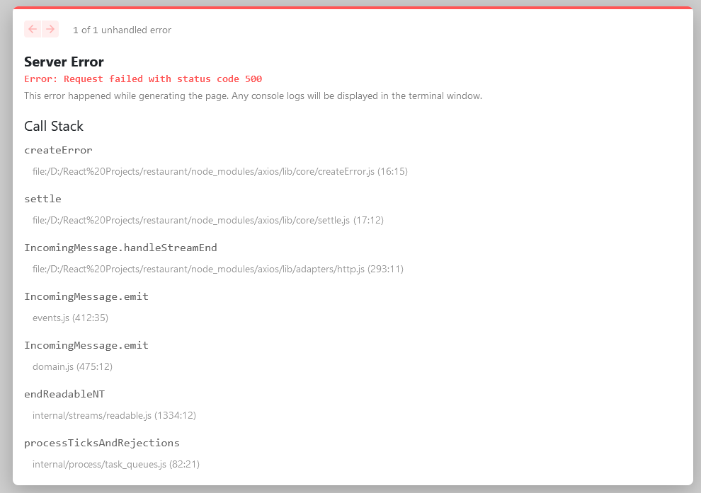
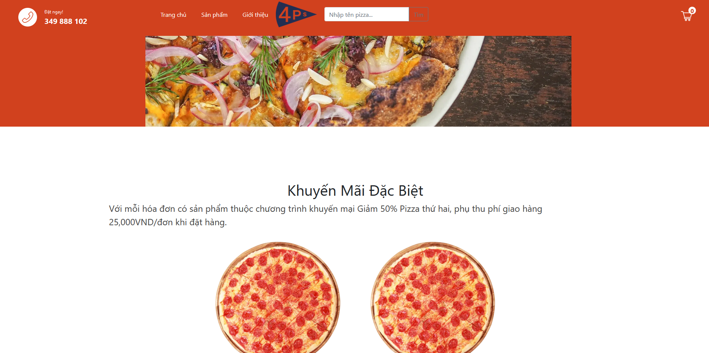
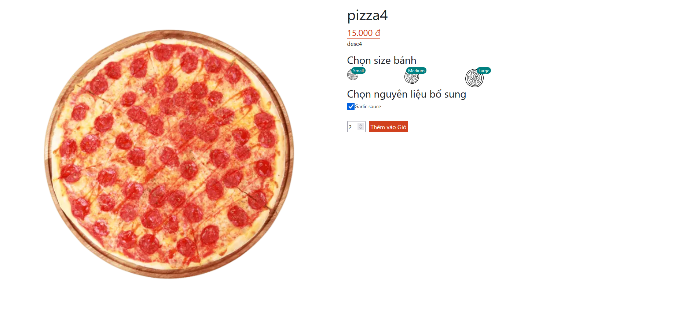
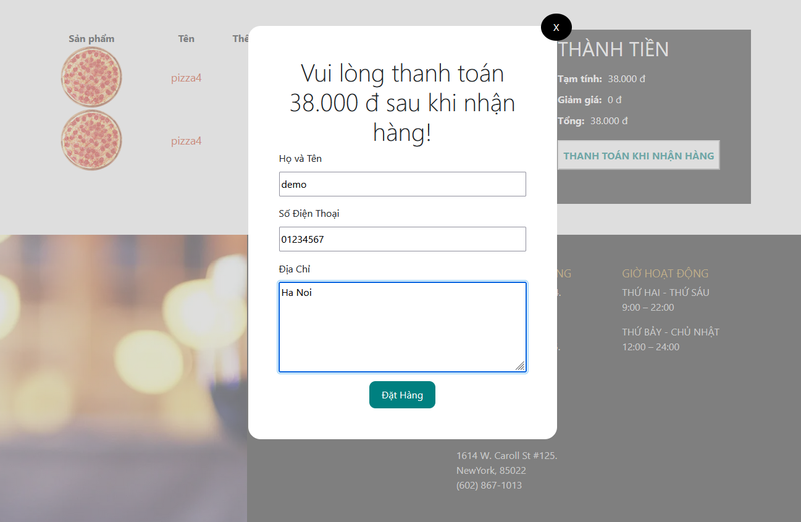
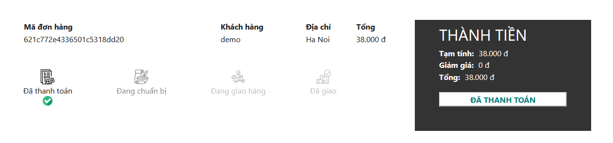
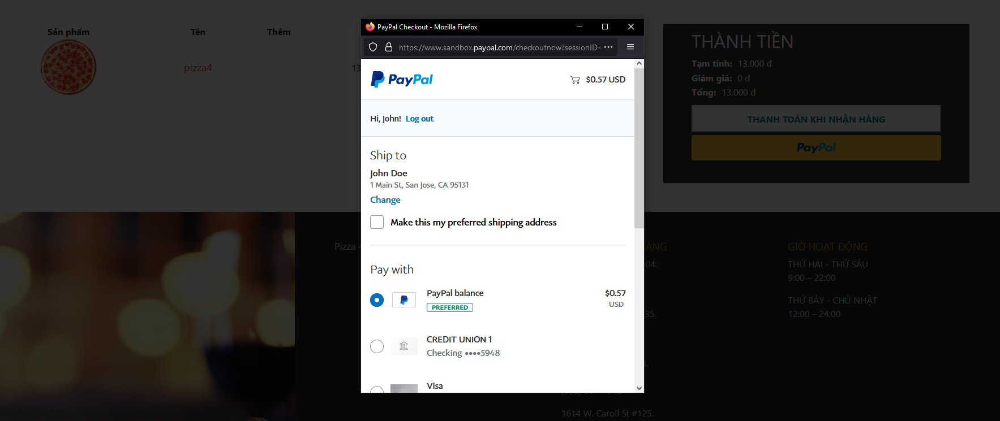
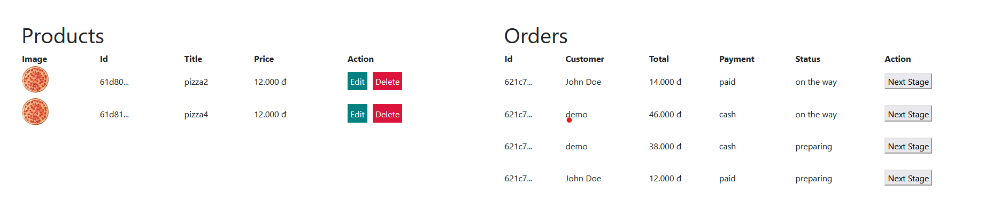

This is a [Next.js](https://nextjs.org/) project bootstrapped with [`create-next-app`](https://github.com/vercel/next.js/tree/canary/packages/create-next-app).

## Deploy on Vercel

Not success
Error: 500 Internal Server Error
Fix on Local: Reload

# pizza-shop

Features in Project:

- View Pizza List
- Add to Cart, pay by Cash or Paypal reactjs, add to order lists
- Search for Pizza Name
  

 

Admin:
<ul>
<li>Login, auth by token</li>
  <li>Add, delete products</li>
  <li>Config orders status</li>
</ul>

